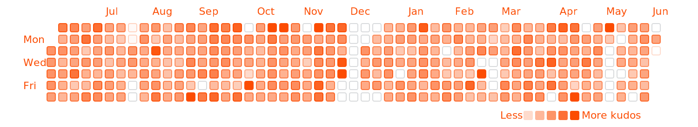

# 🟧 🏃‍♀️ Strava Heatmap 🚴‍♂️ 🟧
## This repo contains utilities for building a custom heatmap based on Strava activities.

## how it works
- using a webhook in strava and vercel serverless functions, every time I upload an activity on strava a github action creates a new version of a strava activity heatmap.

## finds
- unsurprisingly, longer runs, and races get the most kudos